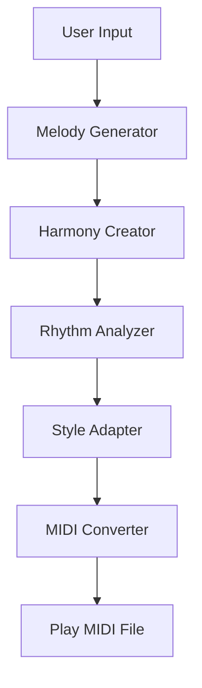

# AI Music Compositor using LangGraph
An AI-powered music composition system built with LangGraph, LLM (DeepSeek), and music processing libraries. This system generates playable MIDI music pieces based on user input (style, mood, key), automatically creating melody, harmony, rhythm, and adapting to specified musical styles.

## 🎯 Features
- **AI-Powered Composition**: Uses LLM to generate melody, harmony, and rhythm in music21 format
- **Style Adaptation**: Supports custom musical styles (e.g., Romantic era, Jazz, Classical)
- **MIDI Generation**: Converts compositions to playable MIDI files
- **Immediate Playback**: Built-in MIDI playback using pygame
- **Customizable Duration**: Adjust music length (seconds) and tempo (BPM)
- **Structured Workflow**: Orchestrated via LangGraph for modular, extendable composition steps

## 🛠️ Installation

### Prerequisites
- Python 3.8+
- DeepSeek API Key (get from [DeepSeek Platform](https://platform.deepseek.com/))

### Step 1: Clone the Repository
```bash
git clone <your-repo-url>
cd ai-music-composer
```

### Step 2: Install Dependencies
```bash
pip install -r requirements.txt
```

### Step 3: Configure Environment Variables
Create a `.env` file in the project root:
```env
# .env file
API_KEY=your_deepseek_api_key_here
```

## 📋 Requirements.txt
```txt
langgraph>=0.1.0
langchain-openai>=0.1.0
music21>=9.1.0
pygame>=2.5.2
python-dotenv>=1.0.0
```

## 🚀 Quick Start

### Run the Composer
```bash
python ai_music_composer.py
```

### Basic Usage Example
The system will generate a 30-second happy piano piece in C major (Romantic era style) by default. To customize:
```python
# Modify inputs in main() function
inputs = {
    "musician_input": "Create a calm piano piece in C minor",
    "style": "Classical",
    "duration_seconds": 45,  # 45 seconds
    "bpm": 70  # 70 beats per minute
}
```

## 🎵 Workflow Architecture
The composition process follows a structured LangGraph workflow:


### Core Components
| Component | Function |
|-----------|----------|
| `melody_generator` | Generates melody in music21 format based on user input |
| `harmony_creator` | Creates complementary chords for the generated melody |
| `rhythm_analyzer` | Analyzes and generates rhythm patterns (duration values) |
| `style_adapter` | Adapts the composition to specified musical style |
| `midi_converter` | Converts music21 notation to playable MIDI file |
| `play_midi` | Plays generated MIDI file using pygame |

## ⚙️ Customization Options

### Adjust Music Duration
Modify `duration_seconds` in the input parameters to change the length of the composition:
```python
# Generate 60-second music
inputs = {
    # ... other parameters
    "duration_seconds": 60,
    "bpm": 90  # Faster tempo (90 beats per minute)
}
```

### Change Musical Style
Supported styles (any style description works):
- Romantic era
- Classical
- Jazz
- Pop
- Blues
- Ambient

Example:
```python
inputs = {
    "musician_input": "Create a upbeat jazz piece in F major",
    "style": "Jazz",
}
```

### Modify Scales/Chords
Edit the `scales` and `chords` dictionaries in `midi_converter()` to add custom musical scales or chord progressions:
```python
# Add custom scale
scales = {
    # ... existing scales
    'F major': ['F', 'G', 'A', 'Bb', 'C', 'D', 'E'],
    'G minor': ['G', 'A', 'Bb', 'C', 'D', 'Eb', 'F#']
}
```

## 📁 Project Structure
```
ai-music-composer/
├── ai_music_composer.py  # Main application file
├── .env                  # Environment variables (API key)
├── requirements.txt      # Dependencies
└── README.md             # Documentation
```

## 🎧 Output
- A temporary MIDI file is generated (path printed in console)
- The MIDI file plays automatically after generation
- To save the MIDI file permanently, uncomment the file copy code in `main()`:
  ```python
  # Uncomment to save MIDI file
  # import shutil
  # shutil.copy(result["midi_file"], "./generated_music.mid")
  ```

## ❗ Troubleshooting

### Common Issues
1. **Model Initialization Error**
   - Check your DeepSeek API key in `.env`
   - Ensure network access to `https://api.deepseek.com/v1/`

2. **MIDI Playback Issues**
   - Verify pygame installation: `pip install pygame --upgrade`
   - Check if your system has MIDI playback support

3. **Short Music Duration**
   - Adjust `duration_seconds` parameter (default: 30 seconds)
   - Modify BPM value to control tempo and perceived length

4. **Music21 Errors**
   - Update music21: `pip install music21 --upgrade`
   - Ensure valid note/chord notation in generated content

## 📝 Notes
- The system uses random selection for melody/chord generation (controlled randomness)
- MIDI files can be opened with any MIDI player (e.g., MuseScore, VLC)
- For longer compositions (1+ minutes), increase `duration_seconds` and adjust BPM accordingly
- The LLM-generated musical notation is parsed and converted to MIDI using music21 library

## 🎨 Extensions
Possible enhancements:
- Add more musical scales and chord progressions
- Implement user interface for input customization
- Add support for different instruments (piano, guitar, strings)
- Implement music export to WAV/MP3 formats
- Add loop/repeat functionality for the generated music
- Integrate with other LLMs (OpenAI GPT-4, Claude)

## 📄 License
This project is licensed under the MIT License - see the LICENSE file for details.
